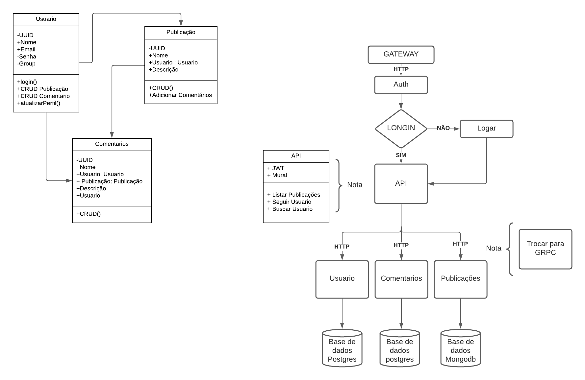

<p align="center">
  <a href="http://nestjs.com/" target="blank"></a>
</p>

[circleci-image]: https://img.shields.io/circleci/build/github/nestjs/nest/master?token=abc123def456
[circleci-url]: https://circleci.com/gh/nestjs/nest

  <p align="center">A progressive <a href="http://nodejs.org" target="_blank">Node.js</a> framework for building efficient and scalable server-side applications.</p>
    <p align="center">

## Description

Está api consome os microservice para fornecer todos os dados para consumo do front-end

## Fluxo


## Métodos

- getAllPublications():  Lista todas as publicações.
- getCommentPublication(): Lista todos os comentários de determinada publicação.
- getAllUserPublications() Lista todas Publicações de determinado usuario.
- getUserInfo(): Lista informações de determinado usuario.
- 
## Installation

```bash
$ npm install
```

## Running the app

```bash
# development
$ npm run start

# watch mode
$ npm run start:dev

# production mode
$ npm run start:prod
```

## Test

```bash
# unit tests
$ npm run test

# e2e tests
$ npm run test:e2e

# test coverage
$ npm run test:cov
```
